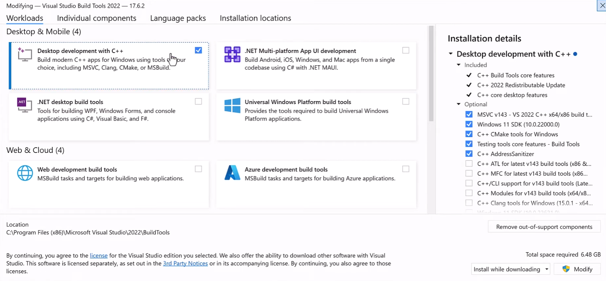

# TextGPT
Leverage OpenAI ChatGPT to perform RAG over a collection of documents

# Installation (Windows 11)

1. Open terminal and navigate to the directory you want to put the repo in
2. In the terminal type:
```
git clone https://github.com/eddieleejw/textgpt.git
cd textgpt
conda env create -f environment_win.yml
conda activate textgpt
pip install requirements_win.txt
streamlit run streamlit.py
```
3. In a web browser, type into the address bar: `http://localhost:8501`

# Installation (Mac M1)
1. Open terminal and navigate to the directory you want to put the repo in
2. In the terminal type:
```
git clone https://github.com/eddieleejw/textgpt.git
cd textgpt
conda env create -f environment_mac.yml
conda activate textgpt
pip install requirements_mac.txt
streamlit run streamlit.py
```
3. In a web browser, type into the address bar: `http://localhost:8501`

# Installation (Docker)

1. Install [Docker](https://www.docker.com/) 
    - Confirm docker installation by opening terminal and typing `docker -v`. It should tell you your docker version
1. Open terminal and navigate to the directory you want to put the repo in
2. In the terminal type:
```
git clone https://github.com/eddieleejw/textgpt.git
cd textgpt
docker build -t textgpt-image .
docker run -p 8501:8501 textgpt-image
```
3. In a web browser, type into the address bar: `http://localhost:8501` (not `http://0.0.0.0:8501`)


# Usage

You will need a valid OpenAI API key to use this chatbot

### OpenAI API Key

1. Sign up for an [OpenAI account](https://openai.com/index/openai-api/)

2. Navigate to the [API keys page](https://platform.openai.com/api-keys)

3. Select "+ Create new secret key", give it a name, and select "Create secret key"

The chatbot will ask you for your OpenAI API key, in order to access the OpenAI language models. 

### Building a database

### Querying the database

1. Open streamlit with `streamlit run streamlit.py`

2. Put in your OpenAI API key

3. Select your project

4. Put in your query

5. Press `Run`

# Example


# Troubleshooting

## Windows installation

Ensure that you have [Microsoft Visual C++ 14.0](https://visualstudio.microsoft.com/visual-cpp-build-tools/) or greater installed

