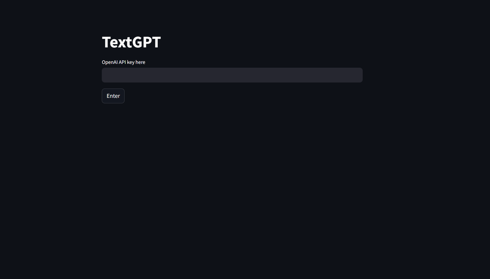
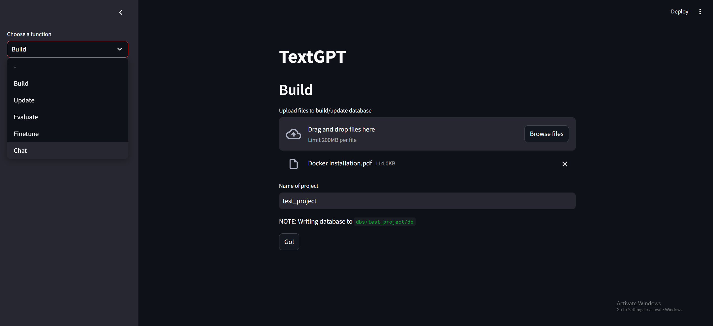
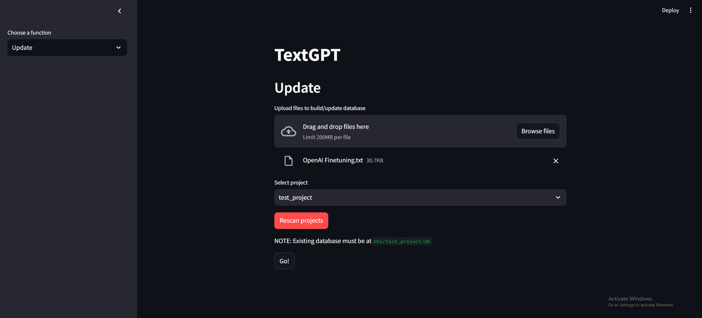
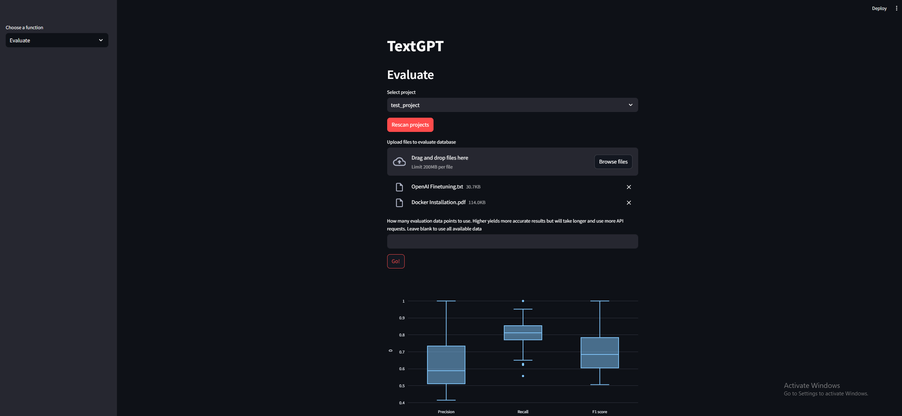

# TextGPT
Leverage OpenAI ChatGPT to perform RAG over a collection of documents

# Installation

If you are on Windows 11 or Apple silicon, you may want to try their respective installation instructions first, as that removed the need for Docker

If the installation instructions are not working or don't exist for your system, use the Docker installation instead

## Windows 11

1. Open terminal and navigate to the directory you want to put the repo in
2. In the terminal type:
```
git clone https://github.com/eddieleejw/textgpt.git
cd textgpt
conda env create -f environment_win.yml
conda activate textgpt
pip install requirements_win.txt
```

## Mac M1
1. Open terminal and navigate to the directory you want to put the repo in
2. In the terminal type:
```
git clone https://github.com/eddieleejw/textgpt.git
cd textgpt
conda env create -f environment_mac.yml
conda activate textgpt
pip install requirements_mac.txt
```

## Installation (Docker)

1. Install [Docker](https://www.docker.com/) 
    - Confirm docker installation by opening terminal and typing `docker -v`. It should tell you your docker version
2. Open terminal and navigate to the directory you want to put the repo in
3. Make sure Docker is running
4. In the terminal type:
```
git clone https://github.com/eddieleejw/textgpt.git
cd textgpt
docker build -t textgpt-image .
```


# Usage

## Launch

### Windows / Mac

1. Open terminal and navigate (e.g. `cd`) to the repository
2. Type into terminal `streamlit run main.py`
3. In a web browser, type into the address bar: `http://localhost:8501`

### Docker
1. Open terminal and type `docker run -p 8501:8501 textgpt-image`
2. In a web browser, type into the address bar: `http://localhost:8501` (not `http://0.0.0.0:8501`)


## OpenAI API Key

You will need a valid OpenAI API key to use this chatbot

1. Sign up for an [OpenAI account](https://openai.com/index/openai-api/)

2. Navigate to the [API keys page](https://platform.openai.com/api-keys)

3. Select "+ Create new secret key", give it a name, and select "Create secret key"

The chatbot will ask you for your OpenAI API key, in order to access the OpenAI language models. Paste your API key here




## Building a database

1. Select the "Build new" option from the "Database operation" drop down menu

2. Drag and drop file(s) that you want to use to create the initial database

3. Give the project a name

4. Press "Go!"



## Updating a database

1. Select the "Update existing" option from the "Database operation" drop down menu

2. Drag and drop file(s) that you want to use to create the initial database

3. Select existing project from the drop down menu
    - Press "Rescan projects" if your project is not showing up in the dropdown menu

4. Press "Go!"



## Evaluating a database

1. Select existing project from the drop down menu
    - Press "Rescan projects" if your project is not showing up in the dropdown menu

2. Drag and drop file(s) that you want to use to evaluate the database

3. Set the number of evaluation data points to use
    - Higher values will use more of the provided files and provide more accurate evaluations, but will take longer and use more API calls
    - Lower values will use less of the provided files and provide less accurate evaluations, but will take less time and use less API calls

4. Press "Go!"




## Querying the database

1. Select existing project from the drop down menu
    - Press "Rescan projects" if your project is not showing up in the dropdown menu

2. Enter your query

3. Press "Go!"


## Reusing a database

Running `docker run -p 8501:8501 textgpt-image` every time will create new containers. To reuse the database(s) that you built before:

1. Open to Docker desktop app

2. Find the container in which you built the database

3. Launch the container using the "Start" button


# Troubleshooting

## Windows installation

Ensure that you have [Microsoft Visual C++ 14.0](https://visualstudio.microsoft.com/visual-cpp-build-tools/) or greater installed

