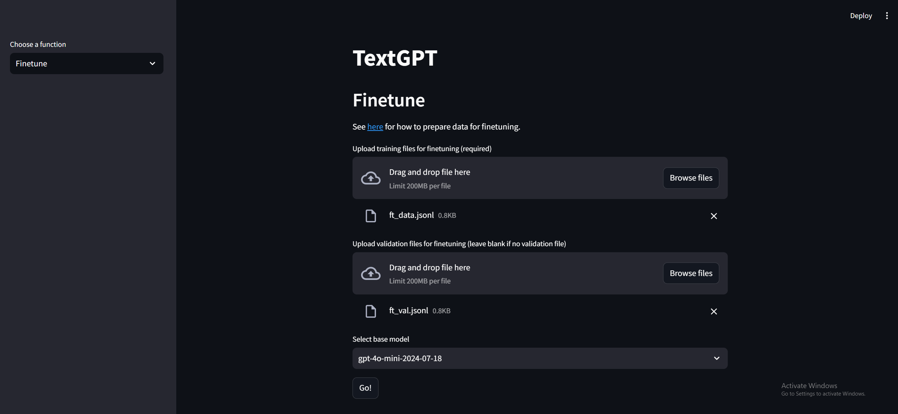
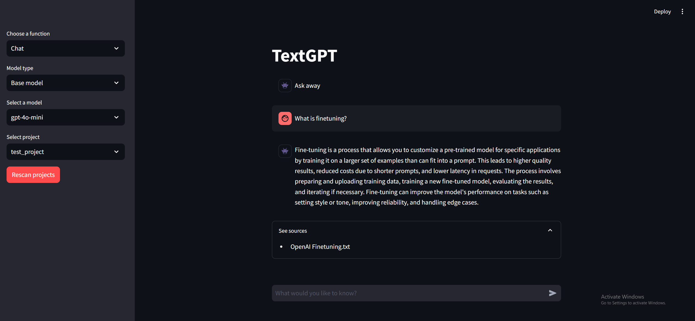

# TextGPT

TextGPT is an open-source project designed to streamline the building and maintaining of RAG systems over local document stores. TextGPT utilises the [LangChain framework](https://www.langchain.com/), [OpenAI API](https://platform.openai.com/docs/overview), and [Chroma databases](https://www.trychroma.com/) to allow you to easily build, update, evaluate, and chat with custom RAG systems at the click of a button.

With TextGPT you can easily:
- **Build** vector databases using local files (`.txt` or `.pdf`)
- **Update** existing vector databases using local files (`.txt` or `.pdf`)
- **Chat** with built databases
- **Evaluate** the performance of different vector databases to help you build databases best suited for your needs
- **Finetune** base chat models from OpenAI, and use it as the LLM layer to provide even greater control over chat outputs

Installation requires [Docker](https://www.docker.com/), which provides containerization and ensures that the program runs consistently across different machines without needing to manually install dependencies.

This was initially developed as part of my [Google Summer of Code 2024](https://github.com/eddieleejw/gprmax_chatbot) project, but is now maintained as a standalone project, with the aim of creating accessible tools for building RAG systems.

*Keywords: RAG, LangChain, LLM, Finetuning*

# How does it work?

### LLM

A LLM (or large language model) are AI models designed to understand and generate human language. These models are trained on large amounts of text, and recent advances in these models have led to powerful and accessible chatbots, such as [ChatGPT](https://chatgpt.com/), with which you can interact with and have a conversation. These chatbots can be used for many tasks including answering questions, telling stories, and even assisting with complex problem-solving.

However, as powerful as these models are, they are not free from drawbacks, one of the most prominent drawbacks being "hallucination".

### Hallucination

"Hallucination" refers to to possibility for a LLM model to generate information that is incorrect, misleading, or even entirely fabricated. This occurs because LLMs generate responses based on patterns learned from vast amounts of training data, as opposed to truly processing the meaning of the text it was trained on. Hence, when asked a question, it is likely that the model responds with an answer that is statiscally likely, but may not be correct. 

Hallucinations can be particularly rampant in those settings where the LLM is being asked about subjects which the LLM never (or rarely) encountered in its training data. Some examples of such settings are:

1. When the LLM is being asked on subjects which did not exist at the time the LLM was trained
    - For instance, a LLM trained in 2022 cannot know about events that occured in 2024 such as how many medals the US won in the 2024 olympics

2. When the LLM is being asked about niche or specialised topics
    - Highly specialisted subjects would not be well represented in the data, such as very specific historical events or specific open source software

One approach to mitigate hallucination is RAG (or retrieval augmented generation).

### RAG

In retrieval augmented generation, retrieval-based methods are combined with generative LLM models to provide more accurate responses on queries to which the LLM may have otherwise hallucinated.

1. We start by hand-picking a collection of verified and accurate source documents from which we want the LLM response to be sourced.

2. We then embed small chunks of these documents in a [vector database](https://www.pinecone.io/learn/vector-database/).

3. At query-time, we use the vector database and retrieval-based methods such as a similarity search, to find document chunk(s) that are most relevant to the query.

4. The LLM is supplied with the query and the context (as well as additional instructions such as to simply reply with "I don't know" if the given context can't answer the query) and generates a response.


# Installation

1. Install [Docker](https://www.docker.com/) 
    - Confirm docker installation by opening terminal and typing `docker -v`. It should tell you your docker version
2. Open terminal and navigate to the directory you want to put the repo in
3. Make sure Docker is running
4. In the terminal type:
```
git clone https://github.com/eddieleejw/textgpt.git
cd textgpt
docker build -t textgpt-image .
```

Building the image may take a few minutes.


# Usage

## Launch

1. Open terminal and type `docker run -p 8501:8501 textgpt-image`
2. In a web browser, type into the address bar: `http://localhost:8501` (not `http://0.0.0.0:8501`)


## OpenAI API Key

You will need a valid OpenAI API key to use this chatbot

1. Sign up for an [OpenAI account](https://openai.com/index/openai-api/)

2. Navigate to the [API keys page](https://platform.openai.com/api-keys)

3. Select "+ Create new secret key", give it a name, and select "Create secret key"

The chatbot will ask you for your OpenAI API key on launch in order to access the OpenAI language models.


## Building a database

1. Select the "Build" option from the drop down menu on the left side of the page

2. Drag and drop file(s) that you want to use to create the initial database

3. Give the project a name

4. Press "Go!"


## Updating a database

1. Select the "Update" option from the drop down menu on the left side of the page

2. Drag and drop file(s) that you want to use to update the initial database

3. Select an existing project from the drop down menu
    - Press "Rescan projects" if your project is not showing up in the dropdown menu

4. Press "Go!"


## Evaluating a database

1. Select the "Evaluate" option from the drop down menu on the left side of the page

2. Select an existing project from the drop down menu
    - Press "Rescan projects" if your project is not showing up in the dropdown menu

3. Drag and drop file(s) that you want to use to evaluate the database

4. Set the number of evaluation data points to use
    - Higher values will use more of the provided files and provide more accurate evaluations, but will take longer and use more API calls
    - Lower values will use less of the provided files and provide less accurate evaluations, but will take less time and use less API calls

5. Press "Go!"


## Finetuning a model

1. Select the "Finetune" option from the drop down menu on the left side of the page

2. Upload a training file (required) and a validation file (optional) for finetuning
    - See [here](https://platform.openai.com/docs/guides/fine-tuning/preparing-your-dataset) for details on how to properly format your data

3. Select a base model from the drop down menu

4. Press "Go!"

5. Check the status of the finetuning in your [OpenAPI dashboard](https://platform.openai.com/finetune)




## Chatting with chatbot

1. Select the "Chat" option from the drop down menu on the left side of the page

2. Select model type from the drop down menu on the left
    - "Base model" gives you the option of choosing between recommended chat models available via the OpenAI API
    - "Custom model" allows you to input any model to chat with. This is useful if you want to chat with a specific version of a model (e.g. "gpt-4o-2024-08-06") or with a custom finetuned model (e.g. "ft:gpt-3.5-turbo-0125:personal::abcdefg")

3. Select the model you want to chat with from the drop down menu (base model), or input your own (custom model)

4. Select the project/database you want to chat about

5. Enter your query in the chat box

6. Click the "See sources" drop down to see the documents referred to by the chatbot




## Reusing a database

Running `docker run -p 8501:8501 textgpt-image` every time will create new containers. To reuse the database(s) that you built before:

1. Open to Docker desktop app

2. Find the container in which you built the database

3. Launch the container using the "Start" button


# Troubleshooting

## Windows installation

Ensure that you have [Microsoft Visual C++ 14.0](https://visualstudio.microsoft.com/visual-cpp-build-tools/) or greater installed

